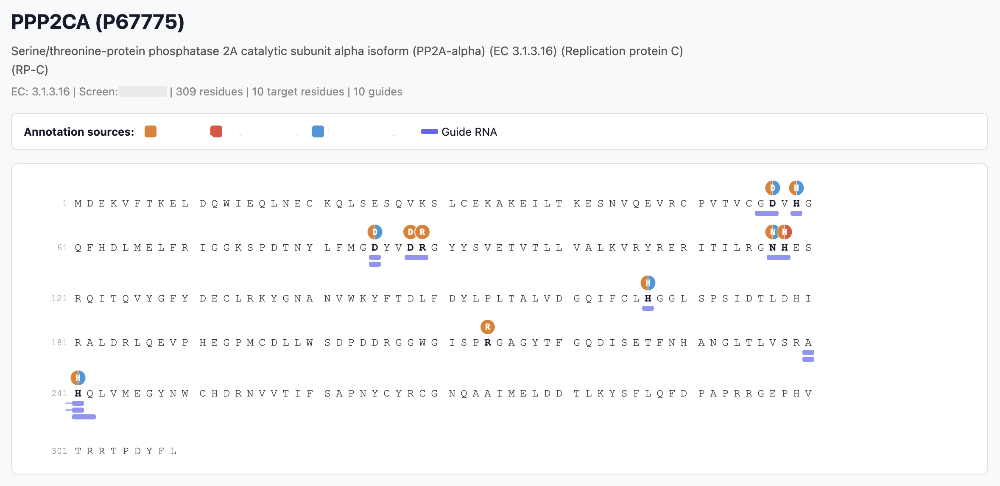

# BE-visualized

A lightweight web application for exploring CRISPR base editing libraries. Search for proteins, inspect annotated target residues and guide RNA designs on an interactive sequence viewer, and visualize 3D structures from AlphaFold — all in the browser.



## Quick start

**Prerequisites:** Python 3.8+

```bash
# Clone and enter the repository
git clone https://github.com/madshmoeller/BE-visualized.git
cd BE-visualized

# Option A — use the startup script (creates a venv for you)
bash run.sh

# Option B — manual setup
python3 -m venv .venv
source .venv/bin/activate
pip install -r requirements.txt
python app.py
```

Open **http://localhost:5002** in your browser.

## Using the website

### Search page

Type a gene name, alias, or UniProt accession into the search bar. Results appear instantly and are grouped into **Targeted** (proteins with guide RNA designs) and **Not targeted** (annotation-only). Use the **Screen** dropdown to filter by screening library.

### Protein page

Each protein page shows:

| Section | Description |
|---|---|
| **Header** | Gene name, UniProt ID, EC number, screen membership, and counts of targets/guides. |
| **Legend** | Color key for annotation sources and guide RNAs. |
| **Sequence viewer** | The full amino acid sequence laid out in rows of 60 residues. Annotated residues are shown as colored circles above the sequence (multi-source residues become pizza-slice charts). Guide RNA editing windows are drawn as bars below the sequence. |
| **3D structure** | An interactive AlphaFold structure (loaded on demand) with target residues highlighted in pink. Click a residue in the sequence to focus and select it in the 3D viewer. |

## Data file format

Place your data files in the `data/` directory. All files are tab-separated (TSV) with a header row.

### `proteins.tsv`

One row per protein.

| Column | Type | Description |
|---|---|---|
| `uniprot_id` | string | UniProt accession (primary key) |
| `gene_name` | string | Gene symbol |
| `gene_aliases` | string | Space-separated alternative names |
| `protein_name` | string | Full protein description |
| `ec_number` | string | EC classification (optional) |
| `length` | int | Sequence length |
| `sequence` | string | Full amino acid sequence (one-letter code) |

### `targets.tsv`

One row per annotated residue.

| Column | Type | Description |
|---|---|---|
| `screen` | string | Screen name (e.g. `ActivEdit`) |
| `uniprot_id` | string | UniProt accession |
| `resnum` | int | Residue number (1-indexed) |
| `resname` | string | Single-letter amino acid code |
| `sources` | string | Pipe-separated annotation sources (e.g. `UniProt Active\|M-CSA`) |
| `role` | string | Functional role description (optional) |

### `guides.tsv`

One row per guide RNA design.

| Column | Type | Description |
|---|---|---|
| `screen` | string | Screen name |
| `uniprot_id` | string | UniProt accession |
| `start` | int | Editing window start residue (1-indexed) |
| `end` | int | Editing window end residue (inclusive) |
| `mutations` | string | Comma-separated mutations (e.g. `V:37->A,S:38->N`) |
| `guide_seq` | string | 20 bp guide RNA sequence |

## Custom colors

Create a `data/colors.json` file to override the default color palette. All fields are optional — unspecified items receive automatic colors.

```json
{
  "sources": {
    "UniProt Active": "#E74C3C",
    "UniProt Binding": "#3498DB",
    "M-CSA": "#E67E22"
  },
  "screens": {
    "ActivEdit": "#c62828",
    "KinasEdit": "#1565c0"
  },
  "guides": "#6366F1",
  "structure": {
    "target_3d": "#FF1493",
    "selection_3d": "#39FF14"
  }
}
```

| Key | Controls |
|---|---|
| `sources` | Annotation circle colors in the sequence viewer. Each key is a source name from the `sources` column in `targets.tsv`. |
| `screens` | Badge colors on the search page. The hex value is used as the text color; the background is derived automatically. |
| `guides` | Color of guide RNA bars in the sequence viewer. |
| `structure.target_3d` | Highlight color for target residues in the 3D viewer. |
| `structure.selection_3d` | Highlight color when selecting a residue in the 3D viewer. |

## Extending the application

### Adding a new page

1. **Define a build function** in [app.py](app.py) that returns a Dash layout:

    ```python
    def _build_my_page(param):
        return html.Div([
            html.H1("My New Page"),
            # ... your components ...
        ], className="my-page")
    ```

2. **Register a route** in the `route()` callback in [app.py](app.py):

    ```python
    if pathname.startswith("/my-path/"):
        param = pathname.split("/my-path/", 1)[1]
        return _build_my_page(param), None
    ```

3. **Add styles** for `.my-page` in [assets/style.css](assets/style.css).

### Adding a new visualization track to the sequence viewer

1. **Create a track builder** in [components.py](components.py) that returns an SVG or HTML element:

    ```python
    def _build_custom_track(row_start, row_end, data, config):
        # Build SVG children using dash_svg components
        children = []
        # ... your visualization logic ...
        return svg.Svg(children=children, className="custom-track",
                       width=total_width, height=track_height)
    ```

2. **Include it in each row** inside `build_sequence_viewer()` in [components.py](components.py):

    ```python
    rows.append(html.Div([
        ann_svg,
        residue_div,
        guide_svg,
        custom_svg,   # your new track
    ], className="seq-row"))
    ```

3. **Style the track** in [assets/style.css](assets/style.css):

    ```css
    .custom-track {
        display: block;
        margin-top: 1px;
    }
    ```

## Project structure

```
BE-visualized/
├── app.py                 # Dash application, routing, and callbacks
├── components.py          # UI component builders (sequence viewer, legend, search results)
├── data_loader.py         # TSV/JSON loading and preprocessing
├── structure.py           # AlphaFold structure download and caching
├── requirements.txt       # Python dependencies
├── run.sh                 # One-command startup script
├── assets/
│   ├── style.css          # All styles
│   └── molstar_selection_mode.js  # Enables click-to-select in the 3D viewer
└── data/                  # Your TSV data files and colors.json (not tracked by git)
```

## License

See repository for license details.
